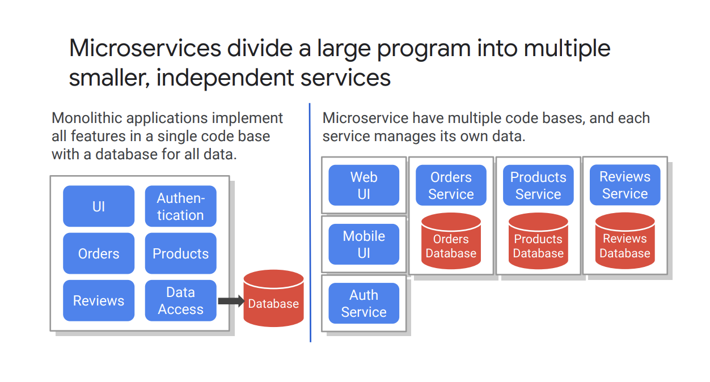
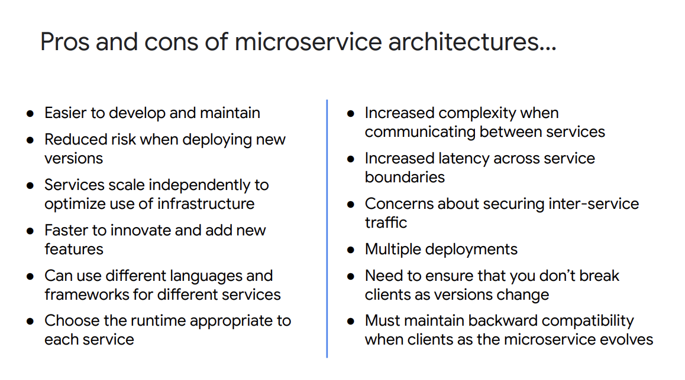

# Microservice Design and Architecture

## Microservices
 Microservices divide a large program into multiple **smaller**, **independent** services.

 

### why MSA is popular these days
 1. To enable teams to work independently
 2. deliver through to production at teams's cadence
 3. to scale the microservies indepently based on requirements.
 4. An designed as a monolith should be composed of modular components with **clear defined boundaries.** but, in MSA, the individual components are **deployable**.
 5. to achive independence on services, each service should have its own datastore. it means they can take **best  datastore** for their servies.

### prons and cons
