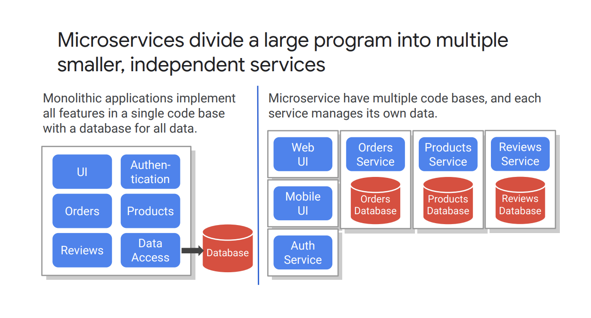

# Microservice Design and Architecture

## Microservices
 Microservices divide a large program into multiple **smaller**, **independent** services.

 

### why MSA is popular these days
 1. To enable teams to work independently
 2. deliver through to production at teams's cadence
 3. to scale the microservies indepently based on requirements.
 4. An designed as a monolith should be composed of modular components with **clear defined boundaries.** but, in MSA, the individual components are **deployable**.
 5. to achive independence on services, each service should have its own datastore. it means they can take **best  datastore** for their servies.

### prons and cons

#start-up #MSA

#### case

배달의 민족 MSA이관 사례

 > MSA는 생존의 문제였다. 

 '생존'에 대해 다시 한번 생각하게 되었다. 스타트업의 의사결정은 하나하나가 생존에 직결된 문제다.
