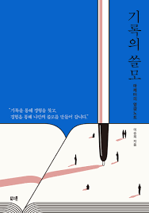

# 책
#책 
기록의 쓸모

#굿즈 
굿즈를 만들 때 가장 많이 하는 시도가 '가장 크게 만들거나' , '가장 작게 만들거나'! - 피자 포장지를 작게 만들어서 메모장으로 만드는 사례
#익숙함 
 익숙한 것에서 낮설음을 느낄 때 사람들은 흥미를 느낀다. - 곰표맥주와 여러 제품과의 콜라보사례에서 확인 할 수도 있다.

 브랜드를 **어떻게 정의**할까에 대해 고민하기!

#피드백 #기록 
피드백을 줄 때 기억해야 할 것
 1. 좋은 환경과 좋음의 기준 만들기 
    '시간을 줄 테니 알아서 잘 해봐' 대신 팀원들과 함께 좋은것에 대해 나누고 좋은 것을 만들 수 있는 환경을 제공할 것!
 2. 사람에 대해 이해하기
    결국 어떤 일을 하든 사람을 이해해야 한다.
 3. 나의 감정 객관화하기
    ex) ~~ 때문에 내 기분은 이런데, 조금 더 생각해 볼 까?
 4. 의도를 설명하고 설득하기
    강요하지 말고 의도를 설명하자!!
 5. 생각할 빈틈 주기
    이미 결론을 내려놓고 시작하는 대화는 최악이다.