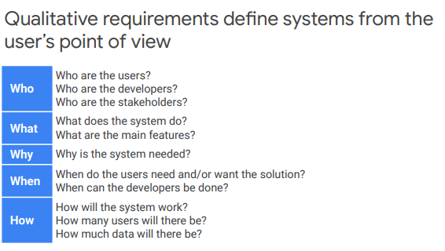
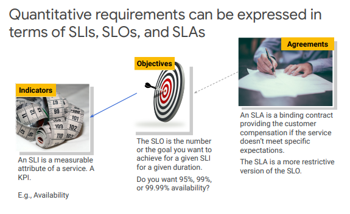

# Defining Services
## Requirements, Analysis, and Design

Qualitaive requirements define systems from user's porint of view

Roles represent the goal of a user at some point.
 - Roles are not people or job titles
 - Roles shoul describe a users objectives

Personas describe a typical person who plays a role.
- Personas tell a story of who they are

User storeies describe a feature from the user's point of view
- **as an** {type of user} , **I want to** {do something} , **so that i can** {get some benefit} 
  
    1. **Independent**: A story should be independent to prevent problems with prioritization and planning. 
    2. **Negotiable**: They are not written contracts, but are used to stimulate discussion between customer and developers until there is a clear agreement. They aid collaboration. 
    3. **Valuable**: Stories should provide value to users.Think about outcomes and impact, not outputs and deliverables.
    4. **Estimatable**: The story must be estimatable. If it is not, it often indicates missing details or the story is too large. 
    5. **Small**: Good stories should be small. This helps keep scope small and therefore less ambiguous and supports fast feedback from users.
    6. **Testable**: Stories must be testable so that developers can verify that the story has been implemented correctly and validate when the requirement has been met/is done.

## SLOs, SLIs, and SLAs
 Quantitative requirements are things that are measurable

### KPI
  In Business, ROI, EBIT, ...
  In software, Page views, User registrations, ...

 For KPIs to be effective, they must ne SMART
    1. Specific rather than general. For example, “user friendly” is not specific; it's very subjective. “Section 508 accessible” is much more specific. 
    2. Measurable is vital because monitoring the KPI indicates whether you are moving toward or away from your goal. 
    3. Being Achievable is also important. For example, expecting 100% conversions on a website is not achievable.
    4. Relevant is absolutely vital. Without a relevant KPI, the goal probably will not be met. In our example of increasing turnover, if we are improving the conversion rate, a subsequent increase in turnover should be achievable–assuming a similar number of users.
    5. Time-bound helps with measuring the KPI. Some KPIs are more sensitive to time; for example, is “availability” per day, per month, or per year?

### SLO, SLI, SLA

 SLI must be time-bound and measureable
 SLO must be achievable and relevant
    고객이 만족하는한 최대한 낮게

 SLS is a business contract between the provider and the customer

  
#SLO #KPI #persona

# 참고자료
[구글 강의자료](https://storage.googleapis.com/cloud-training/archdp/v2.0/OnDemand/01%20Defining%20Services.pdf)
