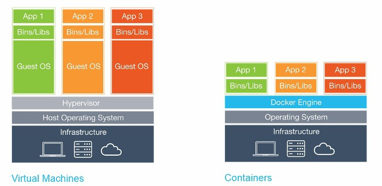

# 가상 머신과 도커 컨테이너

 가상화 기술은 [하이퍼바이저](https://www.redhat.com/ko/topics/virtualization/what-is-a-hypervisor)를 이용해 여러 개의 운영체제를 하나의 호스트에서 생성해 사용하는 방식

## 하이퍼바이즈(Hypervisor)
 하이퍼바이저는 공유 자원을 관리하고 VM을 컨트롤 하는 중간 관리자

 하이퍼바이저는 하드웨어를 직접 제어할 수 있음. -> VM에 대한 라이프 사이클 관리, 실시간 리소스 할당, VM 정책 정의등 기능 수행

## 가상화
 가상화란 물리적인 자원을 동시에 다수의 논리적 자원으로 사용하는 것

## 가상화를 사용하는 이유
 VMware의 책임연구원의 책 [Virtualizatino Essentials](https://iran-lms.com/images/images/Books/PDF/Virtualization-Essentials-Sybex-2016.pdf)에서는 원도우가 single-user Inferface 운영체제라 자원 낭비가 심해서 가상화 기술이 발전했다고 주장.

 빠른 시장 변화에 높은 적응력
 
 보안 수준을 높일 수 있음(접근을 원천 차단)

### 가상화의 종류
 1. 나눠서 쓰는 공유(sharing) : 다수의 가상 자원을 하나의 물리적 자우너과 연결시켜, 시간 분할 기법으로 물리적 자원을 공유
 2. 합쳐서 쓰는 집합(aggregation) : 여러개의 자우너을 하나로 묶어서 물리적인 용량과 성능을 향상시키고, 하나의 논리 장치로 관리
 3. 에뮬레이션(emulation) : 새로 만듦
 4. 자원 절연(resouce insulation) : 물리 장치가 비정상인 상태에서도 논리 장치의 고가용성 보장

### LVM(Logical Volume Manager)
 LVM : [논리적인(Logical) 공간(Volume)을 만들게(Manager) 해주는 프로그램](https://mamu2830.blogspot.com/2019/12/lvmpv-vg-lv-pe-lvm.html)

###  VM과 컨테이너의 가장 큰 차이점 :  자원 공유의 수준 
- VM :  하드웨어의 가상화로 자원을 공유
- 컨테이너 : 호스트 OS, 커널 공간, 라이브러리 바이러니 공유

### 컨테이너가 더 가볍다면 VM 대신 컨테이너만 쓰면 되는거 아닐까?
 => NO. 컨테이너는 OS를 공유하기 때문에 장애 발생시 영향을 받을 수도 있다. 즉, VM이 더 안정적.

---
### 보안 모듈

#### SELinux
 - Security-Enhanced Linux

    강제 접근 제어를 포함한 접근 제어 보안 정책 지원

    리눅스 커널 보안 모듈, 다양한 리눅스 배포판에 추가 가능

    RedHat 계열(RHEL, Fedora, CentOS)

    시스템 전체에 보안 설정

    파일 라벨에 적용

    경로 대신 아이노드 번호로 파일 시스템 객체들을 구별

    CentOS에서 사용

#### APPArmor
-  Application Armor
    
    시스템 관리자가 프로그램 프로필 별로 프로그램 역량을 제한할 수 있게 해주는 리눅스 커널 보안 모듈

    SUSE계열 (SUSE Linux), 데비안 계열(Debian, Ubuntu)

    개별 응용 프로그램을 보호하는 일에 집중

    응용 프로그램 단위의 보안 모델 구현

    AppArmor는 SELinus를 부분 대체

    파일 경로에 적용

    Debian에서 사용

    `enforce모드` : 허가되지 않는 파일에 접근하는 것을 거부
    
    `complain모드` : 실질적 보안 X, 의도된 행동이 아닌경우 로그만 남겨줌

    `sudo aa-staus` 명령어를 통해 현재 상태 확인 가능

#### Access Contorl, 접근 통제
- MAC

    Mandatory Access Control, 강제접근제어
- DAC
    
    Discretionary Access Control, 임의접근제어
    
    [참고자료](https://www.lesstif.com/ws/access-control-dac-mac-43843837.html)

---g

### 우분투 패키지 관리 툴

- APT : advanced packaging tool

    <kbd>apt</kbd> 온라인 리포지포리에서 패키지 다운받고 설치, <kbd>dpkg, apt-get, apt-cache, apt</kbd>같은 구체적인 이름들이 존재

    
- dpkg

    <kbd>dpkg</kbd> cd room 이나 다른 디스크 장치에 있는 .deb파일 제어하는 경우 사용

    시스템 소프트웨어에 대한 설정이나 설치 및 정보를 얻는 명령어 옵션 제공

    <kbd>apt</kbd>보다 낮은 수준에서 작업 수행

- aptitude

    주요 패키지 작업을 자동화하여 가능한 쉡게 작업할 수 있게 해줌

---

## 참고

https://parkseunghan.notion.site/Born2beroot-Subject-6d594d567ed843ba82d7369b0149efe5
